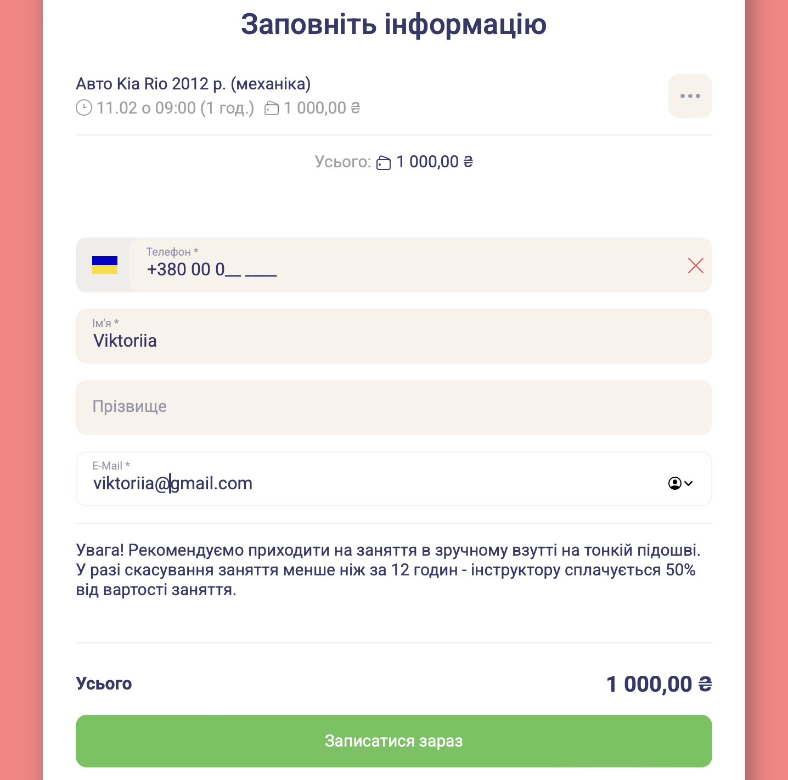
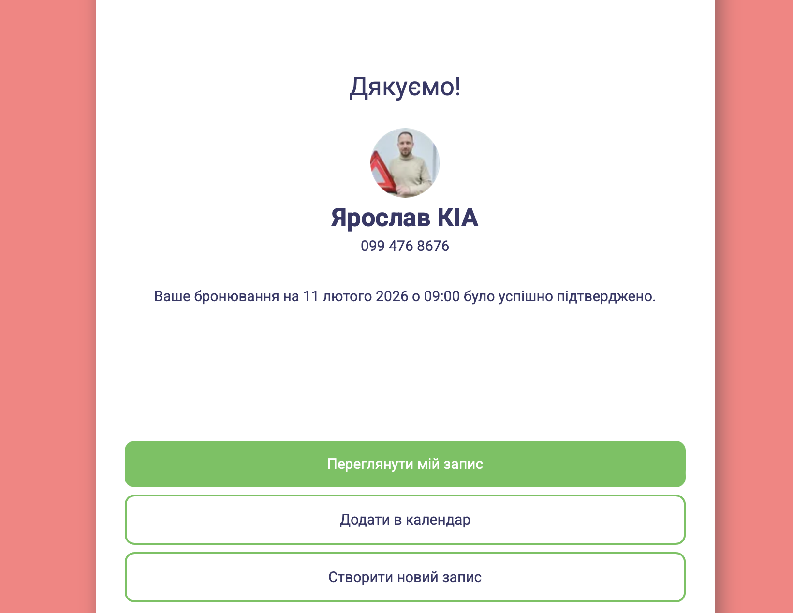

# BR-01: Booking is allowed with invalid phone number

## Summary
The system allows completing a booking even when an invalid phone number is provided.

## Environment
- Platform: EasyWeek (Production)
- Business page: https://widget.easyweek.com.ua/vseukrainska-avtoshkola/137951
- Browser: Safari, Google Chrome

## Preconditions
- Service exists
- Time slot is available

## Steps to Reproduce
1. Open the booking page
2. Select any available service
3. Select an available date and time
4. Proceed to the booking form
5. Enter an invalid phone number (e.g. incomplete number)
6. Enter a valid name
7. Enter a valid email
8. Submit the booking

## Actual Result
Booking is successfully created despite the invalid phone number.

## Expected Result
Booking should be blocked until a valid phone number is provided.

## Severity
Critical

## Priority
High

## Status
Open

## Related Test Case
TC-02: Validate client contact data during booking

## Attachments

